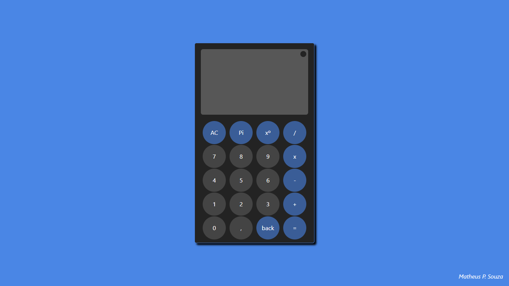

# Calculadora Web com JS

## Sobre o Projeto
Este é um projeto de calculadora online simples. Esta calculadora pode executar operações matemáticas básicas, como adição, subtração, multiplicação e divisão.

### Objetivo: 
Praticar DOM e lógica de programação.

## Tecnologias utilizadas

- HTML, CSS e JavaScript.
- Menu com modo noturno e opção de envio de feedback.

## Como Usar

1. Link do github pages [Calculadora](https://desenvolvedormatheus.github.io/Calculadora/).
2. Clone este repositório em sua máquina local:
   * abra o arquivo index.html
   
## Autor

**Matheus P. Souza**

[E-mail](mailto:desenvolvedormatheus.dev@gmail.com).

[linkedIn](https://www.linkedin.com/in/matheus-souza-460868228/).
